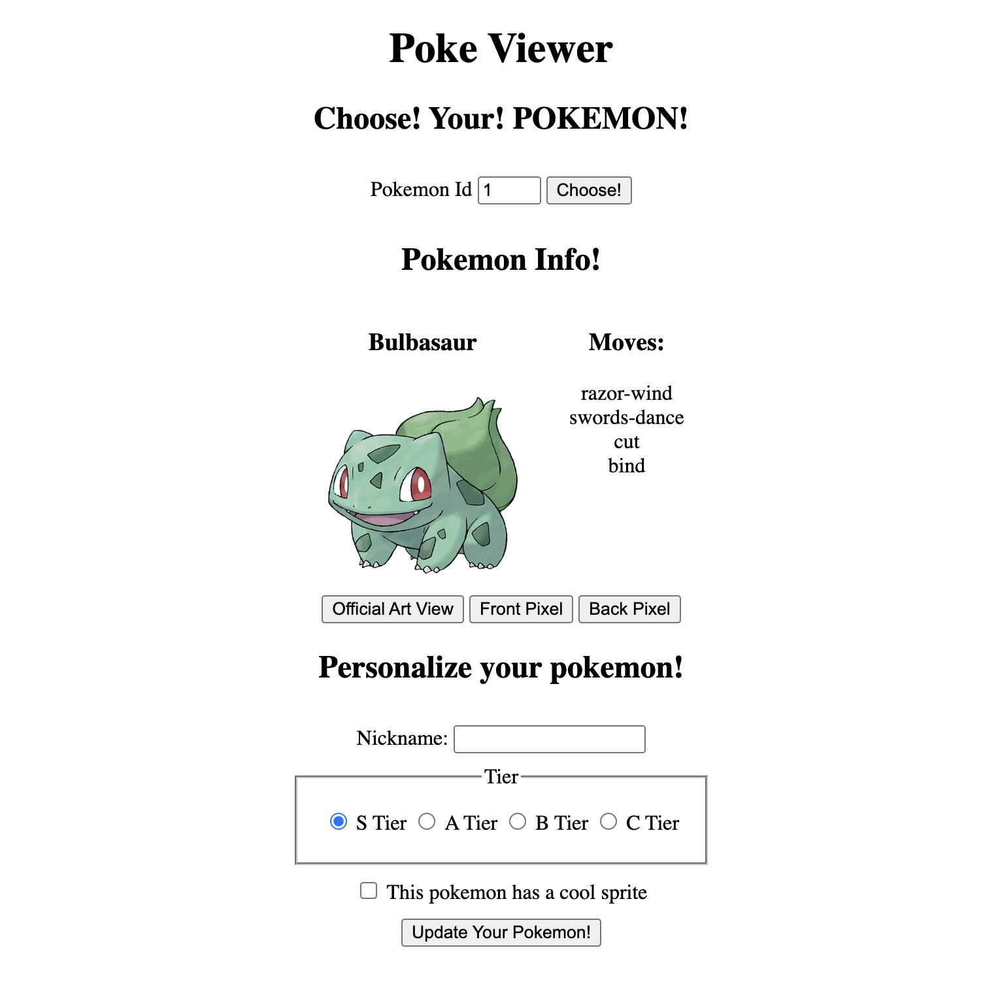
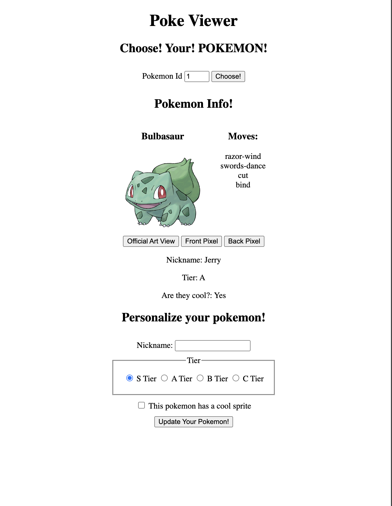
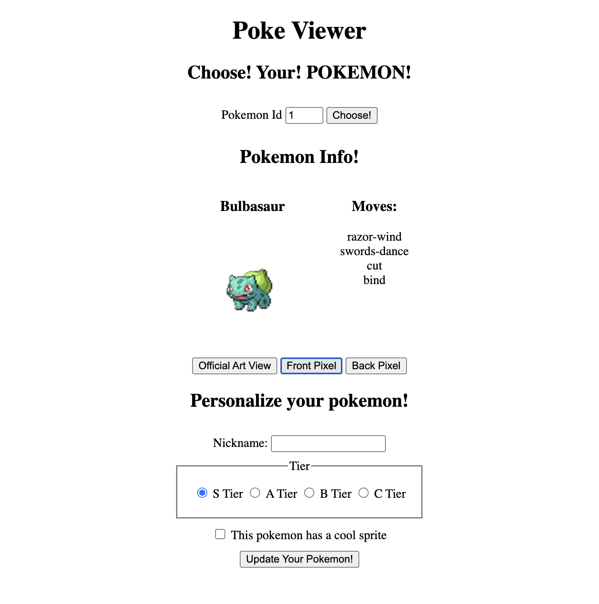
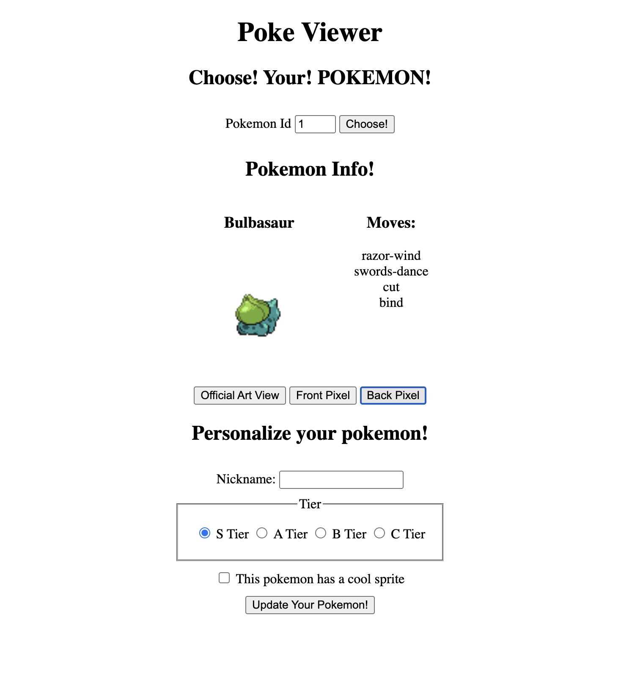
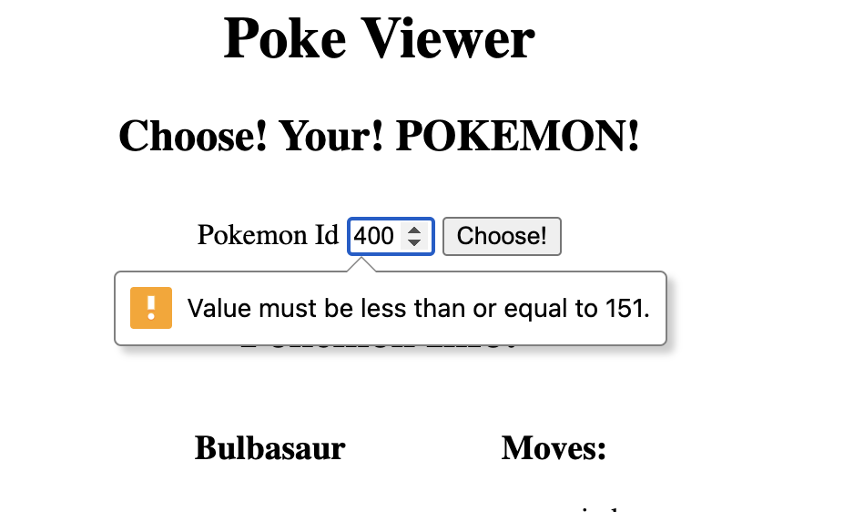

# Lab 3.0.3 - Poke Viewer!
- [Poke Viewer!](#poke-viewer)
- [Project overview](#project-overview)
- [Site Demo](#site-demo)
  - [API Info](#api-info)
  - ["I don't care about pokemon!"](#i-dont-care-about-pokemon)
  - [User Stories](#user-stories)
  - [Off You Go!](#off-you-go)
- [Deployment](#deployment)
- [Project Breakdown](#project-breakdown)
  - [Step 1: Set up your project](#step-1-set-up-your-project)
    - [Check for understanding](#check-for-understanding)
  - [Step 2: Link your files](#step-2-link-your-files)
    - [Check for understanding](#check-for-understanding-1)
    - [End of the body](#end-of-the-body)
    - [Head with defer](#head-with-defer)
    - [Head with type="module"](#head-with-typemodule)
  - [Step 3: Fetch the data](#step-3-fetch-the-data)
    - [Check for understanding](#check-for-understanding-2)
  - [Step 4: Data Wrangling](#step-4-data-wrangling)
    - [Check for understanding](#check-for-understanding-3)
  - [Step 5: Handling State](#step-5-handling-state)
    - [Check for understanding](#check-for-understanding-4)
  - [Step 6: Static/Default Layout HTML](#step-6-staticdefault-layout-html)
    - [Check for understanding](#check-for-understanding-5)
    - [Accessibility](#accessibility)
  - [Step 7: Render the default pokemon](#step-7-render-the-default-pokemon)
    - [Check for understanding](#check-for-understanding-6)
  - [Step 8: Handling button clicks](#step-8-handling-button-clicks)
    - [Check for understanding](#check-for-understanding-7)
  - [Why not add an onclick attribute?](#why-not-add-an-onclick-attribute)
  - [Step 9: Fetching the new pokemon](#step-9-fetching-the-new-pokemon)
    - [Check for understanding](#check-for-understanding-8)
  - [Step 10: Personalizing the pokemon](#step-10-personalizing-the-pokemon)
    - [Check for understanding](#check-for-understanding-9)
  - [Step BONUS: Styling](#step-bonus-styling)
    - [Check for understanding](#check-for-understanding-10)

# Project overview
You're going to be building a site that fetches a single pokemon at a time, and then displays information about it. You can also personalize that pokemon a bit with some more information that *you* enter. This project covers the frontend only and deals with DOM manipulation, data fetching, and state management.

In total, it takes *about* 100 lines of JS and 60 lines of html/css to complete this project. That should be something you can do in two days, and if not, there are plenty of "Check for understanding" questions for you to review. It's time to take your learning into your own hands.

# Site Demo
Here's a look at the finished site, in a gif! (We couldn't link you to the site itself because then you'd be able to copy it, and that's cheating!)


Here's the basic site view:


Here's the site view with the personalization data (this only appears if they fill in the form, and disappears when they load a new pokemon):


The default view is the "Official Artwork" view, but users can use the front and back pixel sprites as well:



And remember, we only want the first 151 pokemon, so block the user from trying to look up anything besides 1-151:


## API Info
We'll be using the [pokemon API](https://pokeapi.co/), specifically the route:
```
GET https://pokeapi.co/api/v2/pokemon/{pokemon-id}
```

Check out the docs for more information about the end point and its structure!

## "I don't care about pokemon!"
Hey, no problem. Sometimes we have to work on topics and projects we don't care about. Honestly, I only picked this API because it has great docs, it's visual, and it's free. Just focus on the features and see this as practice for working on things you don't like.


## User Stories
- A user is greeted by a page that looks exactly (or better styled) that the first example picture
- A user is greeted to the "Bulbasaur" pokemon already fetched and loaded
- A user can select a new pokemon's ID and fetch the data
- **A user can only enter a number from 1-151**
- A user can see the pokemon's name and first 4 moves (or fewer if the pokemon doesn't have that many)
- A user can view the "Official Artwork," "Front Sprite," and "Back Sprite" of the pokemon
  - Use these sprites specifically! That's part of the challenge!
- A user can customize their pokemon with: 
  - a nickname
  - an `S, A, B,` or `C` tier rating
  - a checked box if the sprite is cool
- A user can see the customized information displayed underneath the pokemon's information
- After a user submits the "personalized" data, the form will completely clear
  - Honestly, clearing's not a great design choice in this case, but this is a practice lab, so we want to see if you *can* clear out a form
- When a user loads a new pokemon, all the personalized data will disappear

## Off You Go!
OK, if that's all you need to get started, then get going! In this repo, add all your work and then push up when you're done so we can see it (assuming you started this assignment from GitHub classroom).

# Deployment
You should be deploying! A lot actually! After each step. We're just going to use GitHub pages for this, but that's perfect for a project of this size.

# Project Breakdown
If you need some help, follow theses steps, we'll walk you through it. We'll also highlight the skills we're hoping you have at this point.

## Step 1: Set up your project
### Check for understanding
- Do you know how to create files from the command line?
- Do you know how to (typically) start a node project?
- Do you know why we call it an "index.html" for the main page?

**We don't need this today**, but as a reminder, if you were creating a node project from scratch, *typically* you would do:

```bash
mkdir pokemon-viewer
cd pokemon-viewer
git init
touch .gitignore
# .gitignore is a text file of file names to ignore
echo "node_modules" >> .gitignore
# add our ignore our node_modules folder
npm init -y
# create a package.json file
code .
# Or whatever your system uses to open up your code editor
```

That's pretty much the command line setup for any node project. Now, **you don't actually need any of that because all we're using today is HTML, CSS, and JS**, but it's good to get in the habit of doing this! Today we don't need node_modules or anything like that, so we can skip that step.

Instead, all we need today is to make some files in this diagnostic-lab directory:

```bash
touch index.html
touch style.css
touch index.js
code . # Or whatever your system uses to open up your code editor
```

You can actually put your css and js into a `/src` folder if you want, but since we'll deploy this with github pages, the `index.html` *must* be in the root of your project!

To view your project you just have to open the `index.html file`. You can either do that by using the VSCode live server plugin, or you can open the file by doing "open index.html` in your terminal.

## Step 2: Link your files
### Check for understanding
- Do you know how to link a css file to an html file?
- Do you know the main ways of linking js to html, and the pros and cons of each?
- Do you know *why* it matters **how and where** we link our JS? (Hint: it's because of the DOM and if it's ready or not)

Now that you have your files, you need to link them together. But there are few ways of doing that for JS:

### End of the body
This is the easiest way, you can link a file simply adding the script as the last element of your body:

```html
  </main>
  <script src='./index.js'></script>
</body>
```

### Head with defer
You can also link a file in the head, but you need to add the `defer` attribute to the script tag:

```html
<head>
  <script src='./index.js' defer></script>
  <!-- Rest of head tag -->
```

### Head with type="module"
You can also link a file in the head, but you need to add the `type="module"` attribute to the script tag:

```html
<head>
  <script src='./index.js' type="module"></script>
  <!-- Rest of head tag -->
```

This is very powerful, but it has one drawback: you must serve your files with a server. Do you know how to do that in [VSCode with live server plugin](https://marketplace.visualstudio.com/items?itemName=ritwickdey.LiveServer)?

OK, so like I said, if you don't know what the differences are and why it matters *how* you load your JS, look it up! But since you know how to use Vite, that's probably the way you should build out your projects from now on! It uses modules and also takes care of the server requirement by running a Dev Server for you!

## Step 3: Fetch the data
### Check for understanding
- Do you know how to `fetch` data from an API with a url and options?
- Do you know how to parse the response's body into JSON?
- Do you know how to elegantly handle an http code like a 404?
- Do you know when fetch *actually* throws an error?
  -  (Hint, it's not a 400s or 500s http status code)
- Can you use async/await to make your fetch code more readable?
- Can you use try/catch to elegantly handle errors?
- Can you `throw` your own custom `Error` objects?

The first part of any project should always be the part you control the least. If you're dealing with a 3rd party API, you should always start by making sure you know how to fetch the data you want.

Why don't you build a fetch handler function that takes in a `url` and returns the parsed JSON data. If there's an error, it should handle it and then let's just say log it and return `null`.

To test it, try fetching a pokemon id of 12 and 3020130. The former will give you some data to read and the latter will give you a 404. Can your function handle both situations?

## Step 4: Data Wrangling
### Check for understanding
- Do you know how to read a JSON payload for the information you want?
- Do you know how to save the "shape" of the data you want in your app?


Now that you know how to fetch from the API, the *fun* part begins: wrangling your data! As you can see, the API returns a *ton* of information, and we need select only a small part. Here is what your looking for, can you find it in the data?

- Name
  - The name of the pokemon
- Moves
  - We only need the string names of the first four, how can you find them?
- sprites and images
  - Front sprite
    - A "sprite" is just a pixel image, and there's a front view we need
  - Back sprite
    - Same as above but the sprite shows the back
  - Official artwork
    - I'll give you a tiny hint here: the property name is buried somewhere and called `artwork-official`

There's more data that we'll add ourselves later on, but when it comes to the API, that's all we need. So, can you find that information? Of course, if you would like to use more, feel free, but first make sure to do the minimum!

## Step 5: Handling State
### Check for understanding
- Do you know what we mean when we say "state?"
- Do you know what a data layer is, and why separating the rendering logic from the data logic is important?
- Do you know what "Single Responsibility Principle" is?
- Do you know how to create private data with a closure in JS?
- Do you know what localStorage is?
- Do you know how to create/read data from localstorage?

It's advantageous to store your data in a "data layer" that's separate from your rendering logic. This is a common pattern in React, but it's also a good pattern in vanilla JS (really, everything). If this is totally unfamiliar to you, here's an [explanation of data layers using tic tac toe](https://medium.com/geekculture/understanding-data-layers-without-using-databases-eaa1148ccd8b?sk=531f92e654325b9202cab4a7f8078fbf).

What I recommend is that you do two things:
- store your data behind functions
- Write functions that allow you to CRUD with that data

The reason for this is simple: if you ever change the underlying storage logic, you only have to change it in one place: the function definitions. To the outside world `getPokemon` will always do what it did, but under the hood you could go from in-memory variable, to localStorage, to even using your own DB and API!

Anyway, here's what I recommend you do:
- Store
  - An object/array whatever, that stores your main shared state in a single place. It could be `localStorage`, but it could also just be an internal variable
- getCurrentPokemon
  - Returns the current pokemon object from the store
- setCurrentPokemon
  - Takes in an object, cleans it up, and sets it as the current pokemon
- personalizeCurrentPokemon
  - Takes in an object with the personalize properties, and then updates the current pokemon with those properties

Now note, what's important here is **these** functions don't *render* a thing!! All they do is CRUD your data.

## Step 6: Static/Default Layout HTML
### Check for understanding
- Do you know how to set the `title` of a tab?
- Do you know how to use a `main` tag?
- Do you know how to create a form in HTML?
  - Do you know how to create a number input?
  - Do you know how to create a text input?
  - Do you know how to set a min and max on a number input in html?
  - Do you know how to create a button?
  - Do you know how to create a checkbox?
  - Do you know how to create a group of radio buttons?
  - Do you know how to create a label for *every single input*?
  - Do you know how to associate a label to a specific input with `for` attribute?
- Do you know how to group things with `div` tags?
- Do you know how/why to create use a `section` tag instead of a `div`?
- Do you know what a landmark is?
- Do you know what the `aria-labelledby` attribute does
  - Do you know how to make a `section` a landmark?
  - Do you know how to make a `form` a landmark?
- Do you know how to use a `data`-attribute?
- Do you know how to use `H[1-6]` tags properly and in order?
- Do you know how to set an `img` and give it an `alt` attribute?

Now that we have our data good to go, it's time to start worrying about how we're going to display all this to the user. A good place to start is just setting up the skeleton of the site.

To keep this project simpler (and frankly less tedious), it's ok not to use JS render functions to set up the static portions of our page. You can just write out the basic tags you need in the `index.html` page.

The 4 main parts of the site are:
- The fetching form
- The display of the pokemon's information
- The buttons to alter the view
- The rendered personalization data
- The personalization form

How should you structure these? What's going to be updated by your JS? Think about how to write this HTML to make your JS updates and CSS styling as easy as possible.

### Accessibility
Some of the Accessibility things like "landmarks" you may be unfamiliar with, and that's ok. But what's important is that you know how to use semantic elements like forms, with their inputs *and* labels.

As for sections and some `aria` info, check out this [Kevin Powell video on sections and landmarks](https://www.youtube.com/watch?v=ULdkpU51hTQ). Here's a general [introduction video to Accessibility](https://www.youtube.com/watch?v=qr0ujkLLgmE&t=2s). By the way `A11y` is a short cut for Accessibility because it's an `A`, then 11 letters, then a `y`, get it?

## Step 7: Render the default pokemon
### Check for understanding
- Do you know how to use `document.querySelector`?
- Do you know how to use `element.innerHTML`?
- Do you know how to set some attributes of elements *without* using `element.setAttribute`?
- Can you use `map or forEach` to add a list of elements to the DOM?
- Can you use `ul/li` tags to create a list of elements?

This is the first time we're going to use JS to render something to the page. We're going to start with the default pokemon, "Bulbasaur." So, can you write a function that takes in a pokemon object from state and renders it to the page? This section only uses safe API data, so you can use a template and innerHTML to render it. Or use `createElement` that's fine too!


## Step 8: Handling button clicks
### Check for understanding
- Do you know how to add an event listener to an element?
- Do you know how to handle `click` events?
- Do you know how to use `event.target` to get the element that was clicked?
- Do you know how to use event delegation to handle events on children elements?
- Do you know how to use the data attributes to store and use information on an element?

Here's where you can have a *really* simple event handler if you know how to delegate and use data attributes with each button. Think about what information would be helpful if it was stored *directly* on the button. Perhaps a property name?

## Why not add an onclick attribute?
You could! And in more advanced frameworks like React, you would add an `onclick` attribute to the button. But in vanilla JS, it's better to use event delegation. The reason why is it's usually cleaner. Without a templating language it can get obnoxious to add and manage a bunch of `onclick` attributes to your HTML. However, there is still a time and place for `onclick`s when things like cleanup and removing nodes comes into play.

## Step 9: Fetching the new pokemon
### Check for understanding
- Do you know how to handle a form submission?
- Do you know how to get data from a form?
  - Ideally using the input's `name` off the form for a one input form like this
- Do you know how to use `event.preventDefault` to stop the page from reloading?
- Do you know how to use `event.target` to get the form that was submitted?

We have our little pokemon loaded up and we can change their look, now you just have to use the fetching form to alter the pokemon. You must do 3 things:
- Parse the form data
- Make the fetch
- Render the new data

That's pretty much the patterns for fetching forms like this.

## Step 10: Personalizing the pokemon
### Check for understanding
- Do you know how to use `FormData` api to get more complex data from a form?
- Do you know how to use `document.createElement` to create elements?
- Do you know how to use `element.append` to add elements to the DOM?

This is really just stuff you've done before! The only complicated part is that our form has more, and more complex, inputs. Once you get the data, you just need to render it out onto the page. Remember, every time you load a new pokemon, the personalized data should disappear!

A single word of caution: do not use innerHTML. That's because you're taking user entered data now, and we don't want to accidentally enter malicious data into our DOM. Use `createElement` and `appendChild` to add the data to the DOM.

## Step BONUS: Maintaining personalized information
## Check for undestanding
- How could you save an associate the customized data to the pokemon?

By default, any customized data gets blown away with a new pokemon loading. But what if it didn't? So if you customize your Bulbasaur, fetch a new pokemon, and then **fetch bulbasaur again** the customized data would appear! 

## Step BONUS: Styling
### Check for understanding
- Do you know how to prevent images from making the page "jump" around?
- Do you know how to use `display: flex` to put elements next to each other?
- Do you know how to remove the default styles of lists?

Once you get all the core functionality done, add some styling! As you can see from the gif, we have applied *very* minimal styles to our page. Do you know how to add that bare minimum? And then, can you style this page so that it actually looks nice?
